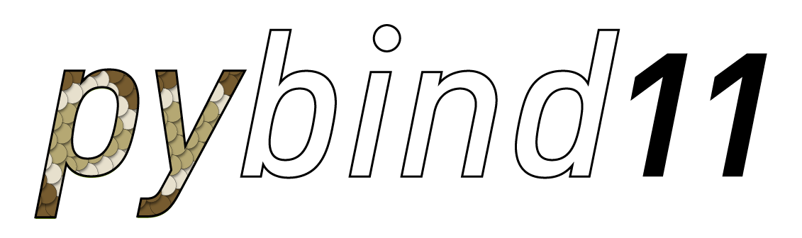

title: Pybind11-tech-share
use_katex: True
language: cpp
number_slides: True
class: title-slide



## Introduction, practical guide, and limitations

Andrew James

.smaller[_May 23, 2022_]

<a class="this-talk-link", href="https://github.com/amjames/pybind11-tech-share" target="_blank">
Slides on github: amjames/pybind11-tech-share</a>

---

class: top

# Overview

<br>

--
## Motivations and goals of the project

--
## Binding Functions

--
## Binding C++ classes

--
## Overloads

--
## NumPy/ Buffer Protocol

--
## Embedding the Python Interpreter

--
.center[
### What is going on in the background
]


---
# What is pybind11

> pybind11 is a lightweight header-only library that exposes C++ types in Python and vice versa, mainly to 
> create Python bindings of existing C++ code. 

- Generate C++ wrappers for native python types.
- Python `PyObject` wrappers for C++ types.

???
This is the first sentence from the pybind11 docs. It summarises things quite nicely.

Primary use case would be this: you have a C++ library, and want to generate python language bindings for it. It does
not require you to really know python at all, but some knowledge can help. Syntactically you create a python module
from your C++ code by writing some more C++. 

---
class: top

# Motivations - Alternatives

???
I'm going to skip over the explanation of why we would want call compiled code from python rather than just writing
python code directly, assuming we are already familiar with those motivations. 

--

### ctypes
The most low-level option. Your library must have an `extern "C"` interface. It is not easy to export types from
your library, and you must use C data types at the call site. It does not scale well.

???
**ctypes**
- You don't need the source for the C-library.
- If you have a C-API you only need to write python code. But still kind of need to know what is going on in C
- Manually handle python-to-c type conversions (POD) 
- Significant amount of work if you are going to export a rich C++ api

--
### Cython
Generating bindings for a C++ library will require writing and maintaining a layer in the Cython language which is 
neither python, nor C. Shines when you want to accelerate parts of the codebase.

???
**Cython** 
- Numpy makes heavy use of it
- Great for accelerating parts of your python library.
- Requires working with a 3rd intermediate language
- Not a great solution if you want to add a python API for a C++ library.


--
### Boost.Python
Very similar to pybind11 in features and syntax. You write binding code in C++. 
Mostly, you are selectively adding features to the python API. The main drawback is boost itself. 

???
**Boost.Python** 
- Bindings written in C++
- With static reflection you probably wouldn't have to write very much code
- Adds a Boost Dependency, and that is where pybind11 comes in.


---

# Motivations

> Think of this library as a tiny self-contained version of Boost.Python with everything stripped away that isn’t 
> relevant for binding generation. This compact implementation was possible thanks to some of the new C++11 features...

.center[_Leveraging C++11 features to write a compact library for python bindings, hence the name *pybind11*._]

???
Again from the pybind11 docs. 

There you have it, something that works very much like boost.python, but does not depend on boost. It is much more
lightweight and due to its simplicity (header only), only depends on python itself. 

---

class: middle

# Writing a simple module

[cppimport](https://github.com/tbenthompson/cppimport) is a neat little tool for playing around with simple pybind11
extensions. I have used for self contained examples of some concepts.

My environment:
.g[
.g-2[
<br>
]
.g-8[
```bash
conda create -n pybind-examples pybind11 ipython pip
conda activate pybind-examples
pip install cppimport
```
]
.g-2[
<br>
]
]

???
cppimport is a nice way to get started quickly, simple single-file extensions are a breeze. 
I used it to create the self-contained examples I am showing here. 

---

# Writing a simple module
.g[
.g-5[
```C++
// cppimport
#include <pybind11/pybind11.h>

double add(double a, double b) {
  return a+b;
}

PYBIND11_MODULE(example1, m) {
  m.def("add", &add);
}

//
//<%
//setup_pybind11(cfg)
//%>
//
```
]
.g-7.g-middle[
A few notes:
- 1<sup>st</sup> line Indicates that the file should be importable.
- Entire example fits on a slide!
- I will be showing the important stuff moving forward, but all of the examples will be on github.
]
]

???
Not every day that even the most basic example fits on one slide. Go over how I will present examples. Not brave enough
to do it live, so I have static excerpts with full working demos in the repo. I just want to go over the boiler plate
above/below the code once since it will be used throughout the examples.

---

# Writing a simple module
.g[
.g-5[
```C++
#include <pybind11/pybind11.h>

double add(double a, double b) {
  return a+b;
}

PYBIND11_MODULE(example1, m) {
  m.def("add", &add);
}
```
]
.g-7.g-middle[
We can import this and run it directly:
```python
>>> import cppimport.import_hook
>>> import example1
>>> example1.add(2.5, 3.2)
5.7
```
]
]
.center[
It will take a moment to (re)-compile after editing
]

???
Take a moment to talk about what we have here. A simple, but complete example of a python module written in C++. 

Less than 20 lines, including w-space and boilerplate. 

Not very interesting, so lets look at a more interesting examples.

---
# Docstrings

When generating python bindings it is important to consider that the user of that API will be expecting certain things
from a python library. Docstrings area great example, there is no need to support `help()` in C++.


???
I am also kind of surprised at how well the default is constructed

This example also hints at how things are working under the hood so I like to talk about it first. 

---
# Docstrings

```
>>> help(example1.add)
...
add(...) method of builtins.PyCapsule instance
    add(arg0: float, arg1: float) -> float
```
???
Pybind11 is taking care of this for us. Of course we can override the default Docstrings, but the default gives a bit
of insight into how pybind11 is working.

--
This is pretty good!

???
We have a fairly descriptive docstring out of the box, with argument and return type annotations.

**NOTE** These are they python types it does not say `double`

We don't have any indication of what the function does, but in this case the name is pretty descriptive

--

We are missing argument names. 


???
I love how you can specify named arguments, and defaults at both the definition and call site. I think it makes for
clear code. 

C++ has some of these concepts, sure argument are given symbols to use within the function scope and you can define
defaults effectively making the argument optional, but not with the same amount of flexibility as python offers.

In particular it is not *easy* to create an interface where you can use the same at the call site to assign a value to
the argument slot, that only happens by the position. 

---
# Docstrings - named arguments

.g[
.g-7[
```c++
*namespace py = pybind11;
PYBIND11_MODULE(example1, m) {
  m.def("subtract", &subtract, "Computes a - b",
    py::arg("a"), py::arg("b"));
}
```
]
.g-5[
<br>
This alias is widely adopted convention

Similar to `import numpy as np`
]
]

???
Quick note before we dive into example 2 we have introduced the universally accepted alias for the pybind11 namespace.
It is used through the documentation and by most users. 

---
# Docstrings - named arguments

.g[
.g-7[
```c++
namespace py = pybind11;
PYBIND11_MODULE(example1, m) {
  m.def("subtract", &subtract, "Computes a - b",
*    py::arg("a"), py::arg("b"));
}
```
]
.g-5.g-middle[
We have now attached names to our arguments by annotating the function binding with some additional information.
]
]

???
This `py::arg` is a special tag class that can be passed to convey metadata to the method we are calling
`module_::def()`

---
# Docstrings - More Metadata

.g[
.g-7[
```c++
namespace py = pybind11;
PYBIND11_MODULE(example1, m) {
  m.def("subtract", &subtract, "Computes a - b",
*    py::arg("a") = 1, py::arg("b") = 2);
}
```
]
.g-5.g-middle[
We can also specify the default values for the arguments.

The number of arguments is statically checked, however the types are not!
]
]

???
Lack of type checking is unfortunate. 

What will happen if we say added `py::arg("c")` to this list is a compile error. Static assert makes for a clear error
message which is nice!

If we instead did `py::arg("a") = "cat"`, we get a somewhat cryptic type error. I will leave that as an exercise for the reader,
but the generated message template implies that the problem is with the user provided argument not any of the
defaults!

---

# Docstrings - More Metadata

.g[
.g-7[
```c++
*using namespace pybind11::literals;
PYBIND11_MODULE(example1, m) {
  m.def("subtract", &subtract, "Computes a - b",
*    "a"_a = 1, "b"_a = 2);
}
```
]
.g-5.g-middle[
We may also use the `_a` suffix (C++11 literals)
]
]

---
# Docstrings

Now the docstring will look more complete

```python
>>> help(example2.subtract)
...
subtract(...) method of builtins.PyCapsule instance
    subtract(a: float = 1, b: float = 2) -> float

    Computes a - b
```

???
We have explored the binding of simple functions, using the metadata annotations and some of the simple features for
bringing python-isims into C++.


---
class: top

# Binding a C++ class
Using `py::class_`:
- Creates a binding for a C++ class or struct.
- The `py:class_` has methods available for binding additional information to the class
- Very similar to `py::module_` (Without additional boilerplate, so no macro is required)

--

.g[
.g-4[
```C++
struct Pet {
    std::string name;
};

```
]
.g-8[
```c++
namespace py = pybind11;
PYBIND11_MODULE(example3, m) {
  py::class_<Pet>(m, "Pet")
    .def(py::init<const std::string&>());
}
```
]
]

--

- The `py::init` wrapper is used to bind constructors for a class
- The template parameters should correspond to a constructor signature
- Without template parameters a callable can be provided which returns the type by value or the appropriate "holder"

???
We will discuss holder types in a bit, but first this is good opportunity to demo overloading

---
class: top
# Binding a C++ class

We use the `py::class_` object to define the python visible interface for the class.

Anything we want to be available in python, must be explicitly declared in the binding

--
```python
import example3
p = example3.Pet("Spot")
*print(p.name) # AttributeError!
```
--
We haven not added an attribute `name` to the python interface for the `Pet` class.

```C++
namespace py = pybind11;
PYBIND11_MODULE(example3, m) {
  py::class_<Pet>(m, "Pet")
    .def(py::init<const std::string&>());
}
```

---

class: top
# Binding a C++ class - Attributes

```C++
namespace py = pybind11;
PYBIND11_MODULE(example3, m) {
  py::class_<Pet>(m, "Pet")
    .def(py::init<const std::string&>());
}
```
--
We have a few different options:

Attributes:
```C++
    .def_readonly("name", &Pet::name)
    .def_readwrite("name", &Pet::name)
```
--

Or property:

```C++
    .def_property("name", /*getter*/, /*setter*/)
    .def_property_readonly("name", /*getter*/)
    .def_property("name", nullptr, /*setter*/) //Write-only property
```
---

# Binding a C++ class - Attributes

If we didn't have a getter/setter already the attribute route is a good one.

We can also use a lambda.

```c++
    .def_property("name", 
        /*getter*/[](const Pet& self) { return self.name; }, 
        /*setter*/[](Pet& self, std::string value) { self.name = value; })
```

???
Anywhere a function may go, binding a function to the module, a method to a class defining a property a lambda will
also be accepted!

---
class: top

Lambdas are particularly useful when you want to do something more pythonic, but don't want to introduce py::types into
your library code

```c++
enum FeatureTypes{...};
std::tuple<bool, bool, bool,...> check_features(...);
```
...

--
```c++
//In binding code
using namespace pybind11::literals;
m.def("check_features", [](...) {
    auto feature_tuple = check_features(...);
    return py::dict("feature_a"_a = std::get<FeatureTypes::A>(feature_tuple),...);
    });
```
--
<br>
Using lambdas at the binding layer to translate c++ patterns to pythonic variants is a popular practice.


---
class: top
# Binding Overloads

If a function has multiple overloads we will have some trouble with the basic pattern for generating a binding
.g[
.g-3[

]
.g-6[
```C++
struct Reader {
  // reads everything
  size_t read()
  // reads from begin to the end
  size_t read(size_t begin) 
  // reads from offset begin to offset end
  size_t read(size_t begin, size_t end) 
};
```
]
.g-3[
]
]

--
.g[
.g-3[

]
.g-6[
```c++
py::class_<Reader>(m, "Reader")
    .def("read", &Reader::read)
```
]
.g-3[
]
]

--
.g[
.g-3[

]
.g-6[
.alert[The compiler is not able to read your mind!]
]
.g-3[
]
]
???

---
# Binding Overloads

We can disambiguate by casting to a function pointer

```c++
py::class_<Reader>(m, "Reader")
    .def("read", static_cast<size_t (Reader::*)(size_t)>(&Rader::read))
```
--

Or there is a handy helper (C++14)

```c++
py::class_<Reader>(m, "Reader")
    .def("read", py::overload_cast<size_t>(&Reader::read))
```
**Note:** The `py::init` wrapper we use to bind constructors takes care of this for us

???
The return type is deduced as we can't overload based on return type this makes sense


---

class: top
# Binding Overloads

It would not be very useful if we could only bind a single overload of a function.

--

We could manually differentiate by binding to different names:
```c++
py::class_<Reader>(m, "Reader")
    .def("read_all", py::overload_cast<>(&Reader::read))
    .def("read_from", py::overload_cast<size_t>(&Reader::read))
    .def("read_between", py::overload_cast<size_t,size_t>(&Reader::read))
```

--

It is not desirable to have our python and C++ api diverge like this.

--

Thankfully pybind allows us to bind multiple methods to the same name!

```c++
py::class_<Reader>(m, "reader")
    .def("read", py::overload_cast<>(&Reader::read))
    .def("read", py::overload_cast<size_t>(&Reader::read))
    .def("read", py::overload_cast<size_t,size_t>(&Reader::read))

```
---
class: top

# Binding Overloads

```c++
py::class_<Reader>(m, "Reader")
    .def("read", py::overload_cast<>(&Reader::read))
    .def("read", py::overload_cast<size_t>(&Reader::read))
    .def("read", py::overload_cast<size_t,size_t>(&Reader::read))

```

How does that work?

--

When we make the first call to `py::class_::def` pybind is going to create an entry in the class `__dict__` for the
method read. It points to the wrapper built around the bound method.

--

When we `.def` the second and third overloads, the existence of the first is detected. This triggers the new method to be 
added to the end of the linked list of methods in the slot.

--

There is some inspection of the metadata for the function to make sure the overload is compatible.

--

In general every callable (instance bound, class bound, or module bound) is set up this way. Even if no overloads are
defined.

---

# Binding Overloads

If you want to influence overload resolution:
 - `py::arg().noconvert()` to prevent casting of an argument even in the relaxed pass
 - The order of `.def` statements will change the order of the list and therefore the search.
 - You can add `py::prepend` to the tags section of the `def` to place it at the beginning of the chain.

The first matching overload is always selected to be called.

There is no priority for minimizing the number of casts required for example.


---
class: top
## Casts/Conversions from Pybind11's Point of view


Consider:

```c++
py::float_ foo(py::list arr);           /* with      */   m.def("foo", &foo);
double bar(std::vector<double> arr);    /* bindings  */   m.def("bar", &bar);
void baz(CustomT& ct);                  /* somewhere */   m.def("baz", &baz);
```
--

When calling `foo([1,2,3])` in python, the layer wrapping the function `foo` applies a thin `py::list` wrapper around some  `PyListObject`.

--

The return involves creating a `py::float_` in c++, but it is also a thin wrapper around a native python type and
removed on the way out.

--

When the wrapping layer for `baz` sees the Python interface for a `py::class_<CustomT>` it does much the same, pulling
a wrapper off to expose the native C++ object.

--
<br>
.center[** None of these operations are considered casts **]

---

class: top

## Casts/Conversions from Pybind11's Point of view


Consider:

```c++
py::float_ foo(py::list arr);           /* with      */   m.def("foo", &foo);
double bar(std::vector<double> arr);    /* bindings  */   m.def("bar", &bar);
void baz(CustomT& ct);                  /* somewhere */   m.def("baz", &baz);
```
What happens with `bar`?

--

The wrapping layer finds no appropriate overload in the strict search.

--

If the argument were a `list` or `tuple` and the contents were all numeric objects. It would be able to cast and make
the call.

--

The key difference is there is no *simple* conversion involving the addition/removal of a pybind wrapper.

--

This is important to consider when defining overloads. If `bar` had an overload accepting `py::list` the
`std::vector<double>` version would *never* match if passed a list on the python side.

---

# Holder types

All pybind wrapped types `py::class_<T>` uses a special holder type to manage references to the object. The default is
to use `std::unique_ptr<T>`.

This will mean that the pybind11 wrapper is going to reference count for us and delete the object when it no longer
referenced anywhere.

Sometimes, a codebase may rely on `std::shared_ptr<T>` heavily, and it is possible to specify this as holder type for
the object.

```c++
class AlwaysShared {};
py::class_<AlwaysShared, std::shared_ptr<AlwaysShared>>(m, "AlwaysShared");
```

Now pybind11 will allow the smart pointer to do the reference counting.

--

**Careful!** Any bound function returning a raw pointer will improperly be captured in a *new* `shared_ptr`.

---

# NumPy / Buffer Protocol

Built in support for the Python Buffer protocol

.g[
.g-6[
```c++
class Matrix {
public:
    Matrix(size_t rows, size_t cols) 
        : m_rows(rows)
        , m_cols(cols) {
        m_data = new float[rows*cols];
    }
    float *data() { return m_data; }
    size_t rows() const { return m_rows; }
    size_t cols() const { return m_cols; }
private:
    size_t m_rows, m_cols;
    float *m_data;
};
```
]
.g-6[
```c++
py::class_<Matrix>(m, "Matrix", 
  py::buffer_protocol()
).def_buffer([](Matrix &m){
  return py::buffer_info(
    /* Pointer to buffer */
    m.data(),
    /* Size of one scalar */
    sizeof(float),
    /* Python struct format descriptor */
    py::format_descriptor<float>::format(),
    /* Number of dimensions */
    2,
    /* Buffer dimensions */
    { m.rows(), m.cols() },
    /* Strides (in bytes) */
    { sizeof(float) * m.cols(),
      sizeof(float) }
  );
});
```
]
]

---

# NumPy / Buffer Protocol

This makes it possible construct a NumPy array from our `Matrix` object without an expensive copy of the underlying
data.

We could design a constructor for our `Maxtrix` object which makes it a view on some NumPy owned memory.

--

There is also direct support for NumPy arrays `py::array`.

--

A `py::vectorize` wrapper for transforming scalar ops into vectorized point wise ops over NumPy arrays

```c++
double add_3(double a, double b, double c) { return a + b + c }
m.def("vectorized_add_3", py::vectorize(add_3))"
```

---

class: top
# Embedding the interpreter
```python
# plots.py
def plot_x_squared(x):
    import matplotlib.pyplot as plt
    plt.plot(x, x**2)
    plt.show()

```
```c++
#include <pybind11/embed.h>
namespace py = pybind11;
int main()
{
    using namespace py::literals;
    py::scoped_interpreter guard{};
    py::module_ np = py::module_::import("numpy")
    py::object x = np.attr("arange")(0, 100);
    py::module_ plots= py::module_::import("plots");
    plots.attr("plot_x_squared")(x);
    return 0;
}
```
.center[Very easy to embed a scripting console in your application!]

---

class: title-slide

# Thank you!

.larger[Andrew James]<br>
.smaller[_May 23, 2022_]

<a class="this-talk-link", href="https://github.com/amjames/pybind11-tech-share" target="_blank">
Slides on github: amjames/pybind11-tech-share</a>
